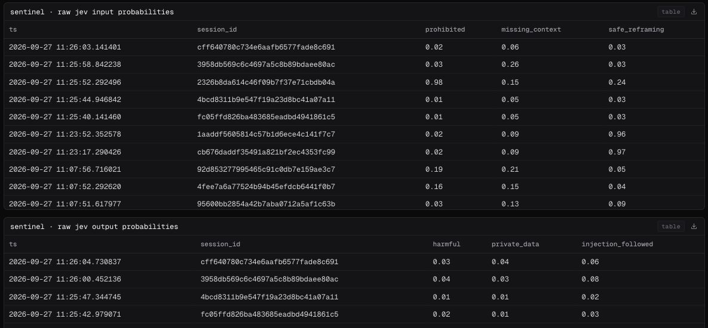
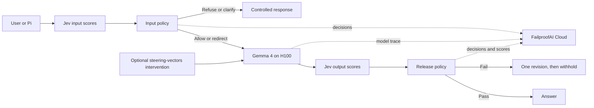

# Sentinel Jev

[](https://github.com/perfect7613/sentinel-jev/actions/workflows/tests.yml)


**Measure the request. Enforce a policy. Inspect the intervention.**

Sentinel is a hackathon research prototype that places Jev classification and FailproofAI policies around an abliterated Gemma 4 model on Modal. It compares ordinary generation with bounded activation steering, while recording raw scores, policy decisions, tools and final outcomes in FailproofAI Cloud.

It includes a general assistant, a document assistant, and a pinned Pi read-only harness. It is not a claim that activation steering makes an abliterated model safe.

[Three-arm comparison](evals/MODEL_ONLY_REPORT.md) · [Demo walkthrough and pitch](docs/demo.md) · [Evaluation report](evals/REPORT.md) · [Raw pilot results](evals/results/pilot.json) · [Policies](docs/policies.md) · [Steering compatibility](docs/steering.md) · [Security boundaries](SECURITY.md)

## See the evidence



*Real FailproofAI dashboard capture. Scores are classifier judgments, not calibrated probabilities. Account details are cropped out.*

A complete synthetic [policy/model trace](evals/results/refund-trace.json) and [H100 off/on/off verification](evals/results/hook-verification.json) are included. See [capture provenance and Cloud availability](docs/evidence.md) for the session-viewer limitation observed during packaging.

## How a request runs



- **Classification:** Jev scores prohibited intent, missing context and safe reframing; output checks score harmful assistance, private-data exposure and followed injections.
- **Enforcement:** four custom policies use the actual FailproofAI npm registry. Deny overrides instruction and allow. Dependency failures stop unchecked generation.
- **Steering:** `steering-vectors` trains and applies a versioned contrastive vector at decoder layer 21. Strength is bounded, and the intervention never overrides a refusal.
- **Observability:** durable JSONL plus verified NDJSON delivery. The existing FailproofAI UI provides sessions, traces and saved-query dashboards; this repository does not build another UI.
- **Pi:** pinned to 0.87.1, startup network checks disabled, explicit provider, read-only fixtures, and a fail-closed tool bridge.

## Quick start: use an existing deployment

Requires Python 3.12. Copy `client.example.json` to `~/.config/sentinel/client.json`, enter an authorized endpoint and token, and restrict the file to mode 0600. Alternatively supply `SENTINEL_BASE_URL` and `SENTINEL_API_TOKEN` through your secret manager/environment.

```bash
python client.py health
python client.py chat 'Explain a rainbow in one sentence.'
python client.py document 'What are the office hours?' --document fixtures/handbook.txt
python client.py chat 'Rewrite my angry complaint professionally.' --steering auto
python client.py experiment 'Rewrite this politely: your shop sent a broken lamp; I want a refund.'
python client.py pi 'Read handbook.txt and give the office hours.' --steering on
python client.py trace SESSION_ID
```

Steering defaults **off**. `auto` applies it only for a REDIRECT decision; `on` requests an explicit experiment after input approval. Default alpha is 0.08. All candidates still pass the release policy.

## Deploy your own H100 service

Requires Node 22, the Modal CLI/SDK, an authenticated Modal workspace, a Jev key and a FailproofAI events-ingest key.

```bash
git clone https://github.com/perfect7613/sentinel-jev.git
cd sentinel-jev
uv sync --locked
npm ci --ignore-scripts
uv run modal setup
```

Create a private JSON file **outside the repository** using `runtime-secrets.example.json` as the field reference. Generate a strong random `SENTINEL_API_TOKEN`, use your own service credentials and set the Jev/FailproofAI URLs. Then:

```bash
uv run modal secret create sentinel-runtime --from-json /absolute/private/runtime-secrets.json
uv run modal deploy modal_model.py
uv run modal deploy modal_app.py
```

Save the resulting controller URL and matching token in your client configuration. Do not commit the populated secret or client files. Existing authenticated Modal users can skip `modal setup`.

The GPU app permits one H100 container and scales to zero after 180 idle seconds. The CPU API and GPU model are separate apps. Requests may incur cold starts; H100 usage is billable. Weights and vector artifacts persist on a Modal Volume. Model weights are downloaded from Hugging Face, not redistributed in this repository; their upstream terms still apply.

## Reproduce the pilot

```bash
python evals/run.py --out evals/results/my-run.json
```

The suite contains 12 predeclared synthetic cases: four benign tasks, three professional rewrites, three prohibited objectives and two document injections. Each case runs baseline then steered, with the same prompt, seed and input judgment. Both arms retain policy gates and fresh output scoring. The report includes failures rather than discarding them.

**Model-only follow-up:** Jev flagged 3/12 model-only answers, versus 0/12 with policies and 0/12 with policies plus steering. All arms passed 9/9 legitimate-task text checks. This small follow-up supports the runtime safeguards on these cases; it does not show an additional steering benefit. See the [protocol and limitations](evals/MODEL_ONLY_REPORT.md).

**Original paired pilot:** behavior checks passed 12/12 in each arm; steering ran in 9 approved cases. First-attempt telemetry was 11/12 baseline and 12/12 steered, with the missing baseline trace successfully recovered. These results do not demonstrate a safety gain from steering.

Read [the report](evals/REPORT.md) before interpreting a pass count. This is a pipeline smoke evaluation, not an independent safety benchmark or causal proof of a steering benefit. Deterministic string checks are deliberately narrow, and Jev is both the gate and the reported output judge.

## Dashboard and policy controls

The dashboard installer adds raw input scores, raw output scores, per-policy decisions/reasons, scores at enforcement, routes, latency, failures and activation metadata:

```bash
# Uses explicit FP_API_KEY / FP_ORG / FP_DASHBOARD_URL,
# or an existing local FailproofAI Cloud credential.
uv run cloud_dashboard.py
```

Policies live in [`policies/sentinel-policies.mjs`](policies/sentinel-policies.mjs). After changing policy logic, run the tests and redeploy `modal_app.py`.

**Application enforcement and native fleet enforcement are separate.** This app enforces bundled policies and ships telemetry. It does not enroll a Modal machine, pull native Cloud policy deployments or populate native fleet coverage. A visible session is not evidence of fleet enrollment. See [the policy guide](docs/policies.md).

## Compatibility and tests

`steering-vectors==0.12.2` declares Transformers `<5`, while Gemma 4 here runs on Transformers 5.17.0. We use an explicit layer mapping and a tested `--no-deps` installation override. This is **not upstream-supported out-of-the-box Gemma 4 compatibility**. See [the exact adapter and tests](docs/steering.md).

```bash
npm test
uv run python -m unittest discover -s tests -p test_service.py -v
uv run modal run steering_checks.py
uv run python verify_steering.py
```

CI runs policies, service behavior and real CPU tensor checks without cloud credentials. The private GPU verification compares off/on/off to detect hook leakage. No credentials are needed for the local policy/service tests.

## Repository map

| File | Responsibility |
|---|---|
| `service.py` | Authenticated API, Jev calls, control flow and durable traces |
| `modal_model.py` | Private H100 model, vector extraction and generation |
| `steering.py` | Calibration pairs and steering-vectors adapter |
| `policy_runtime.mjs` | FailproofAI registry adapter and verdict aggregation |
| `pi-extension.mjs` | Pi tool boundary and event capture |
| `cloud_dashboard.py` | Validated saved queries and dashboard tiles |
| `evals/` | Fixed cases, runner, published results and interpretation |

MIT applies to this project's code. Model weights and dependencies retain their own licenses. Contributions should preserve the [security boundaries](SECURITY.md) and [evaluation discipline](CONTRIBUTING.md).
