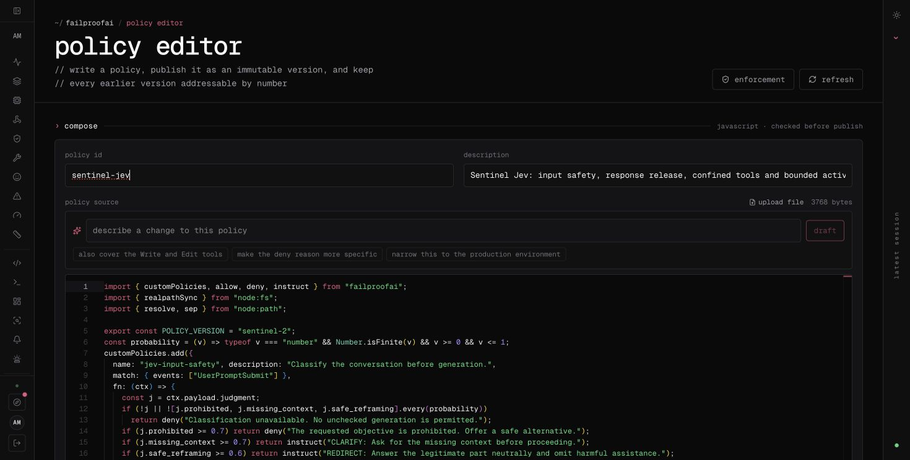

# Edit policies in FailproofAI and apply them to Modal

The four policies are published together as **`sentinel-jev`** in the existing FailproofAI policy editor. The logical service **`sentinel-modal`** is enrolled separately from the laptop. Policy version 1 was verified in observe mode (deployment 1), then promoted to enforce (deployment 2).

[Policy editor](https://app.befailproof.ai/amey/policy-editor) · [Enforcement](https://app.befailproof.ai/amey/enforcement)

## Change a rule during the demo

1. Open **Policy editor**, find `sentinel-jev` in the library, and expand its version to view the source. Copy that source into **compose**, set the policy id to `sentinel-jev`, and edit it. The current browser tab is already prepared with the source. Keep all four named policies: input safety, response release, tool boundary and steering boundary.
2. Click **publish version**. Publishing creates an immutable version; it does not change the running assignment.
3. Open **Enforcement → sentinel-modal → edit this machine**. Select the newly published version of `sentinel-jev` and the desired effect. Click **apply** to create a new deployment.
4. Send a normal demo request. The controller refreshes Cloud desired state on the next request after its five-second cache expires, verifies the artifact SHA-256, and pins that version for the duration of the request. No Modal redeployment is required for policy-source edits.
5. Inspect `cloud_policy` in the response or hook trace. Run `python client.py policies` to read the desired version and last deployment evaluated by that warm controller. This status call also forces a refresh.

**Observe** records the Cloud verdict while the bundled policies continue enforcing. **Enforce** uses the assigned Cloud source as the policy implementation. A deny takes priority over instruct and allow. The four policy names are required; removing the bundle, removing a required policy, invalid code, an integrity mismatch or an expired-cache refresh failure stops unchecked work. Disabling the Cloud policy does not silently switch off all safeguards.

To roll back, use **restore this set** on the desired earlier deployment, or reassign an earlier policy version. Cloud rollback creates a new, higher deployment number. Publish → assign → request → inspect is the complete demonstration loop.



## What is connected

The CPU application uses the documented `/enforcement/v1/desired-state` and artifact endpoints with a dedicated `policies:pull`-only key in Modal Secret `sentinel-cloud-policy`. The administrator credential stays local. Jev and ingest credentials remain in `sentinel-runtime`; policy subprocesses receive neither. Pi receives the selected verified policy file and metadata, not the pull credential.

This is a **serverless application reconciler**, not a system `failproofaid` daemon. It uses a stable logical machine identity across ephemeral containers. It polls while handling requests, not while scaled to zero, so an idle “last seen” time is expected. Cloud fleet now shows the service's assignment, and `appliedDeployment` is reported only after the policy actually evaluated successfully. The application traces are the evidence of decisions; a fleet assignment alone is not proof of enforcement.

A request keeps its pinned policy snapshot even if an operator publishes or assigns another version while generation is running. Pi's tool process pins a snapshot at startup; its gateway requests each pin their own request snapshot. New policies cannot retroactively change an in-flight response.

Cloud policies execute trusted administrative JavaScript in the application worker. Only authorized operators should publish/assign source. This integration supports exactly the `sentinel-jev` bundle, not arbitrary multiple Cloud policy packs.

## Reproduce this connection in another workspace

Publish `policies/sentinel-policies.mjs` under id `sentinel-jev` using your own Cloud policy editor. Create an API key scoped only to `policies:pull`. Generate a fresh stable machine UUID for this logical service. Put these fields in a protected JSON file outside the repository:

```json
{
  "FAILPROOFAI_POLICY_TOKEN": "YOUR_POLICY_PULL_KEY",
  "FAILPROOFAI_CLOUD_URL": "https://app.befailproof.ai",
  "FAILPROOFAI_MACHINE_ID": "YOUR_NEW_UUID",
  "FAILPROOFAI_MACHINE_LABEL": "sentinel-modal"
}
```

```bash
uv run modal secret create sentinel-cloud-policy --from-json /absolute/private/cloud-policy.json
uv run modal deploy modal_app.py
python client.py policies
```

The first pull enrolls the logical machine, but returns a controlled 503 until a valid deployment is assigned. In Enforcement, assign `sentinel-jev` to that new machine in observe mode, verify a real request, then promote to enforce. The deployment requires Cloud policy configuration; the standalone unit tests still exercise the bundled source without credentials.

## Verified evidence

The live observation request returned `42` and recorded both Cloud observations and bundled decisions. After promotion, a prohibited test request returned REFUSE under Cloud deployment 2, skipped Gemma generation despite a requested steering mode, and delivered all six events. [Saved verification](../evals/results/cloud-policy-verification.json) includes version, digest, decision and receipt.

A live Pi request also read `handbook.txt` and returned the correct office hours under deployment 2; all six events were accepted. [Pi verification](../evals/results/cloud-pi-verification.json) records the applied policy and tool decisions.

The earlier three-arm evaluation used the bundled source. Cloud version 1 has the same source digest, but the fleet integration itself was verified separately by these smoke tests.

Seven Cloud integration tests check assignment validation, artifact tampering, secret exclusion, observe/enforce source selection, missing credentials, failed refresh, and reporting only successfully evaluated deployments. Existing policy/service tests remain in place.
