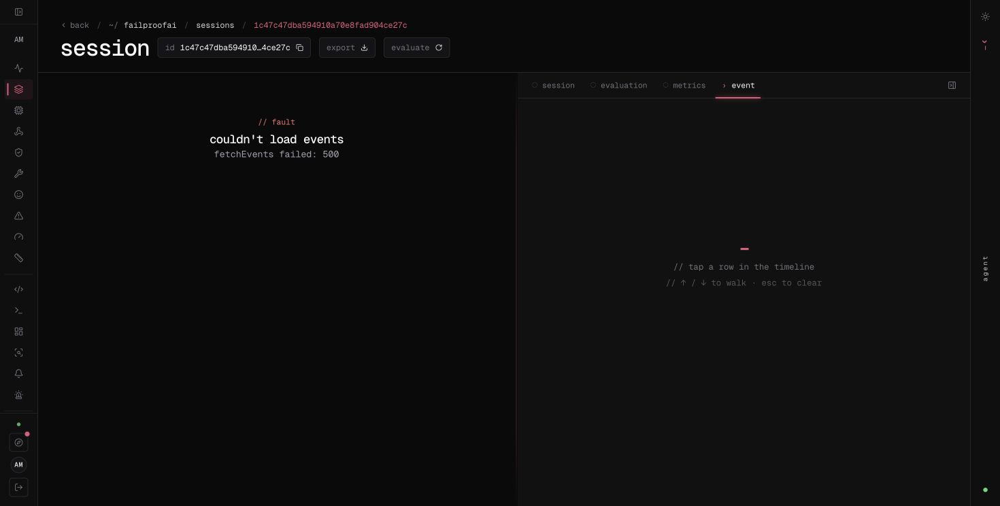

# Evidence and availability

These artifacts come from the deployed H100 service and FailproofAI Cloud on 27 September 2026. They are real outputs, not rendered mockups.

## Raw-score dashboard

This capture shows input and output score tables in the existing FailproofAI UI. It was taken while query reads were working; some rows predate the published pilot. The dashboard has ten installed tiles. The four added tables contain raw input scores, raw output scores, individual policy decisions, and input scores at enforcement. Account details were cropped out.

## Trace and verification logs

- [Complete synthetic refund-request trace](../evals/results/refund-trace.json): 12 events, including Jev scores, policy reasons, H100 model output, 85 activation-hook calls, layer 21, alpha 0.08 and final release.
- [Off/on/off H100 responses](../evals/results/hook-verification.json): the final baseline matches the initial baseline, with zero hooks on both; the intervening steered run records 22 hooks and relative delta approximately 0.08.
- [Pilot results](../evals/results/pilot.json): all 24 arms, including the original failed upload receipt.
- [Delivery recovery](../evals/results/delivery-recovery.json): the failed upload subsequently returned HTTP 200 with all 6 events accepted.

The selected full trace is a reviewed synthetic professional-rewrite case. No withheld sensitive content or credentials are included. Input judgment is reused from the paired baseline, so this steered trace has no separate input Jev call; the judgment is attached to the policy events.

## Cloud read failure during packaging

During the final screenshot pass, two pilot session pages returned `fetchEvents failed: 500`. A read-only saved-query validation also reported a ClickHouse `MEMORY_LIMIT_EXCEEDED` error. The dashboard had already been installed and verified earlier. The later installer attempt stopped at its validation stage, without modifying it.

This screenshot documents the failure; it is not presented as a successful trace view. The full durable trace was retrieved successfully from the authenticated Modal API and is linked above. The backend's shared memory limit requires a FailproofAI service-side resolution; this repository cannot fix it. An accepted ingest receipt confirms ingestion, not continuous availability of the Cloud query UI.
